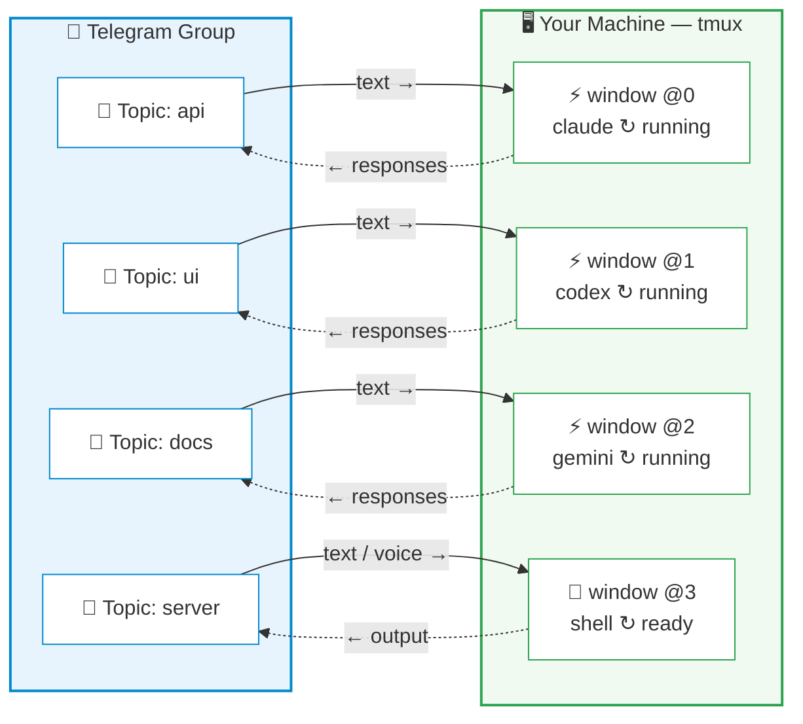

# CCGram Notify

[](https://github.com/alexei-led/ccgram/actions/workflows/ci.yml)
[](https://pypi.org/project/ccgram/)
[](https://pypi.org/project/ccgram/)
[](https://pypi.org/project/ccgram/)
[](https://pypi.org/project/ccgram/)
[](LICENSE)
[](https://github.com/astral-sh/ruff)

Control AI coding agents from your phone. CCGram bridges Telegram to tmux so you can monitor output, respond to prompts, and manage sessions without touching your computer. This fork packages that bridge as **CCGram Notify**: a Codex-first install flow that makes normal `codex` launches enter the monitored workflow in quiet `notify` mode, while Telegram-opened sessions stay fully `interactive`.

CCGram Notify still supports [Claude Code](https://docs.anthropic.com/en/docs/claude-code), [Codex CLI](https://github.com/openai/codex), [Gemini CLI](https://github.com/google-gemini/gemini-cli), and plain shell sessions with LLM command generation.

## Why CCGram?

AI coding agents run in your terminal. When you step away — commuting, on the couch, or just away from your desk — the session keeps working, but you lose visibility and control.

CCGram fixes this. The key insight: it operates on **tmux**, not any agent's SDK. Your agent process stays exactly where it is, in a tmux window on your machine. CCGram reads its output and sends keystrokes to it. This means:

- **Desktop to phone, mid-conversation** — your agent is working on a refactor? Walk away and keep monitoring from Telegram
- **Phone back to desktop, anytime** — `tmux attach` and you're back in the terminal with full scrollback
- **Multiple sessions in parallel** — Each Telegram topic maps to a separate tmux window, each can run a different agent

Other Telegram bots wrap agent SDKs to create isolated API sessions that can't be resumed in your terminal. CCGram is different — it's a thin control layer over tmux, so the terminal remains the source of truth.

## How It Works



Each Telegram Forum topic binds to one tmux window running an agent CLI. Messages you type in the topic are sent as keystrokes to the tmux pane; the agent's output is parsed from session transcripts and delivered back as Telegram messages.

## Features

**Session control**

- Send messages directly to your agent topic
- `/commands` shows commands supported by that topic's provider (Claude/Codex/Gemini/Shell)
- Forwarded slash commands report provider mismatch errors (for example Claude-only `/cost` in Codex)
- Command menu auto-switches per user/chat to the active topic provider after interaction
- Interactive prompts (AskUserQuestion, ExitPlanMode, Permission) rendered as inline keyboards
- Codex edit approvals are reformatted for Telegram readability (compact summary + short preview, with approval choices preserved)
- Codex `/status` replies include a bot-side transcript snapshot (session + token/rate-limit stats) when Codex does not emit a normal transcript message
- Multi-pane support — auto-detects blocked panes, surfaces prompts, `/panes` command for overview
- Terminal screenshots — capture the current pane (or any specific pane) as a PNG image
- Voice message transcription via Whisper API (OpenAI, Groq) with confirm/discard keyboard
- Sessions dashboard (`/sessions`) — overview of all sessions with status and kill buttons
- Remote Control detection — 📡 topic badge when RC is active, one-tap activation from status keyboard
- Action toolbar (`/toolbar`) — persistent inline buttons for RC, Screenshot, Esc, Notify, Ctrl-C

**Real-time monitoring**

- Assistant responses, thinking content, tool use/result pairs, and command output
- Live status line showing what the agent is currently doing
- Entity-based formatting with automatic plain text fallback
- Notify mode suppresses routine chatter and only delivers explicit milestone/final summaries when the assistant prefixes a message with `[CCGRAM_MILESTONE]` or `[CCGRAM_FINAL]`. The marker is stripped before Telegram delivery.

## Modes

- `interactive`: full Telegram mirror for sessions intentionally opened or rebound from Telegram
- `notify`: quiet monitoring for unattended or normally launched sessions; only blocking prompts, failure/dead notices, and explicit milestone/final summaries break through

**Session management**

- Directory browser for creating new sessions from Telegram
- Auto-sync: create a tmux window manually and the bot auto-creates a matching topic
- Fresh/Continue/Resume recovery when a session dies
- Message history with paginated browsing (`/history`)
- Persistent state — bindings and read offsets survive restarts

**Multi-provider support**

- Claude Code (default), OpenAI Codex CLI, Google Gemini CLI, and Shell
- Per-topic provider selection — different topics can use different agents simultaneously
- Auto-detects provider from externally created tmux windows (process name, with ps-based TTY detection fallback for JS-runtime-wrapped CLIs like bun/node)
- Provider-aware recovery (Continue/Resume buttons adapt to each provider's capabilities)
- [Emdash](https://emdash.ai) integration — auto-discovers emdash tmux sessions; bind Telegram topics to emdash-managed agents with zero configuration

**Shell provider**

- Chat-first: type natural language → LLM generates a shell command → approve with one tap → output streams back
- Raw mode: prefix with `!` to bypass the LLM and send commands directly
- Voice-to-command: voice messages transcribed via Whisper, then routed through the LLM for command generation
- Dangerous command detection with extra confirmation step
- BYOK LLM — supports OpenAI, Anthropic, xAI, DeepSeek, Groq, Ollama (zero new dependencies)
- See **[docs/providers.md](docs/providers.md#shell)** for LLM configuration

**Extensibility**

- Global Telegram menu includes bot commands + default provider commands (with `↗` prefix); provider-scoped menus auto-refresh per chat/user/topic context with Telegram-scope fallbacks
- Tmux session auto-detection — when running inside tmux, auto-discovers the session and picks up existing agent windows; duplicate instance prevention
- Multi-instance support — run separate bots per Telegram group on the same machine
- Configurable via environment variables

## Quick Start

### Prerequisites

- **Python 3.14+**
- **tmux** — installed and in PATH
- **At least one agent CLI** — `claude` (default), `codex`, or `gemini` installed and authenticated (or use the plain `shell` provider with no extra install required)

### Install

```bash
# GitHub checkout
git clone https://github.com/alexei-led/ccgram.git
cd ccgram
uv tool install --editable .
```

On a fresh machine, the first `uv tool install --editable .` may download build/runtime dependencies such as `hatchling`, `hatch-vcs`, and wheels that are not already cached.

The repo also ships plugin-style metadata in:

- `.codex-plugin/plugin.json`
- `.claude-plugin/plugin.json`
- `.claude-plugin/marketplace.json`

### Configure

1. Create a Telegram bot via [@BotFather](https://t.me/BotFather)
2. Configure bot settings in BotFather:
   - **Allow Groups**: Enabled (Bot Settings > Groups & Channels > Allow Groups? > Turn on)
   - **Group Privacy**: Disabled (Bot Settings > Groups & Channels > Group Privacy > Turn off) — _Required to see all messages in topics_
   - **Topics**: Enabled (Bot Settings > Groups & Channels > Edit Topics > Enable)
3. Add the bot to a Telegram group with Topics enabled.
4. **Promote the bot to Administrator** and ensure it has the **Create Topics** permission (required for the bot to automatically sync and manage session topics).
5. Run the guided notify installer for normal Codex launches:

```bash
ccgram notify install --provider codex --shell bash
ccgram notify status
ccgram doctor
```

`ccgram notify install` now prompts for any missing Telegram setup, writes `~/.ccgram/.env` for you, and then installs the shell integration. It asks for:

- bot token from [@BotFather](https://t.me/BotFather)
- allowed Telegram user IDs (get yours from [@userinfobot](https://t.me/userinfobot))
- optional Telegram group ID (for single-group restriction; use [@RawDataBot](https://t.me/RawDataBot) if you want to set it)

For automation or CI, you can still pass these explicitly:

```bash
ccgram notify install \
  --provider codex \
  --shell bash \
  --non-interactive \
  --bot-token "$TELEGRAM_BOT_TOKEN" \
  --allowed-users "123456789" \
  --group-id "-1001234567890"
```

After this one-time step, typing plain `codex` routes into the monitored tmux workflow and defaults to `notify`.

### Install hooks (Claude Code only)

```bash
ccgram hook --install
```

This registers Claude Code hooks (SessionStart, Notification, Stop, StopFailure, SessionEnd, SubagentStart, SubagentStop, TeammateIdle, TaskCompleted) for automatic session tracking, instant interactive UI detection, API error alerting, session lifecycle cleanup, and agent team notifications. Not needed for Codex or Gemini — those providers are discovered from hookless transcripts and tmux window/provider detection.

> If hooks are missing, ccgram warns at startup with the fix command. Hooks are optional — terminal scraping works as fallback.

### Configure LLM for Shell Provider (optional)

To enable natural language → shell command generation in shell topics, add an LLM provider:

```ini
CCGRAM_LLM_PROVIDER=openai   # or: anthropic, xai, deepseek, groq, ollama
```

See **[docs/providers.md](docs/providers.md#llm-configuration)** for all options. Without an LLM, shell topics forward text as raw commands.

### Run

```bash
ccgram
```

Open your Telegram group, create a new topic, send a message — a directory browser appears. Pick a project directory, choose your agent (Claude, Codex, Gemini, or Shell), then choose session mode (`✅ Standard` or `🚀 YOLO`), and you're connected.

### Everyday Notify Workflow

After `ccgram notify install`, normal `codex` launches default to `notify`:

```bash
codex
```

That launch enters the monitored tmux workflow, can proactively message you in Telegram when it blocks, and still supports phone-side approvals through the existing interactive UI bridge.

Telegram-created sessions stay `interactive`, so the user-opened topic remains fully chatty like a remote terminal.

### Notify Management

Check current shell integration:

```bash
ccgram notify status
```

Temporarily stop intercepting plain `codex` without removing the rest of the setup:

```bash
ccgram notify disable
```

Remove the shell hook and direct-launch override completely:

```bash
ccgram notify uninstall
```

### Notify-mode summaries

Quiet `notify` topics stay silent unless there is a blocking prompt or the agent emits an explicit summary marker. Use these prefixes in assistant output:

```text
[CCGRAM_MILESTONE] shell integration installed
[CCGRAM_FINAL] task complete, tests passed
```

CCGram strips the marker before forwarding the message to Telegram.

For unattended work, this is the expected contract:

- routine progress stays quiet in `notify`
- blocking prompts surface automatically
- milestone and final summaries must be explicit

## Migrating from ccbot

CCGram was previously named `ccbot`. If upgrading from v1.x:

```bash
# Install new package
pip install ccgram   # or: brew install alexei-led/tap/ccgram

# Migrate config directory
mv ~/.ccbot ~/.ccgram

# Update environment variables: CCBOT_* → CCGRAM_*
# Old CCBOT_* vars still work as fallback with deprecation warnings

# Re-install hooks (replaces legacy "ccbot hook" entries)
ccgram hook --install
```

## Documentation

- **[docs/guides.md](docs/guides.md)** — CLI reference, configuration, upgrading, multi-instance setup, session recovery, testing
- **[docs/providers.md](docs/providers.md)** — Provider details (Claude, Codex, Gemini, Shell), session modes, LLM configuration, custom launch commands

## Development

```bash
git clone https://github.com/alexei-led/ccgram.git
cd ccgram
uv sync --extra dev

make check        # fmt + lint + typecheck + unit + integration tests
make test-e2e     # E2E tests (requires agent CLIs, see docs/guides.md)
```

## Acknowledgments

CCGram started as a fork of [ccbot](https://github.com/six-ddc/ccbot) by [six-ddc](https://github.com/six-ddc), who created the original Telegram-to-Claude-Code bridge. This project has since been rewritten and developed independently with multi-provider support, topic-based architecture, interactive UI, and a comprehensive test suite. Thanks to six-ddc for the initial idea and implementation.

## License

[MIT](LICENSE)
